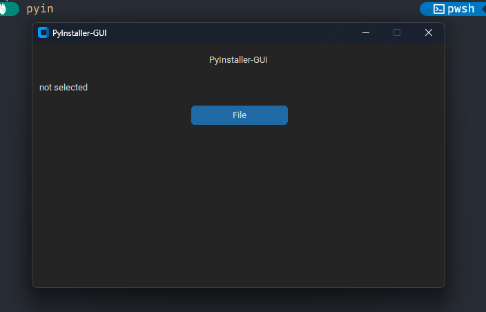
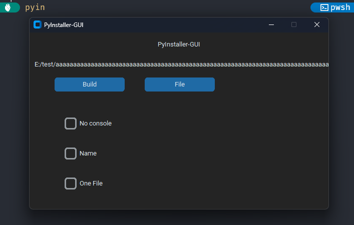

# PyInstaller-GUI
A front-end for the Python Library PyInstaller for making executables out of .py files.
# Attention!
- This package REQUIRES PyInstaller to be installed. Use ```pip install pyinstaller``` if you dont have it installed.
- the package is still in development. 
- When compiling a project , the output will be at 'C:\Users\user\dist\'.
- For now , only the 'No console' , 'Name' and 'One File' flags are available.
# Coming soon
- The Add Files flag.
- Because there are over 70 flags , i cant add all of them in the app but there will be a text box where you can add the flags you want.
# Setup 
- First cd in the directory where the setup.py file is located.
- To install the package use ```pip install .```
- After all of that is done, use the ```pyin``` command in your terminal to run the package.
# Screenshots
{ width=200 ; height=100 }

